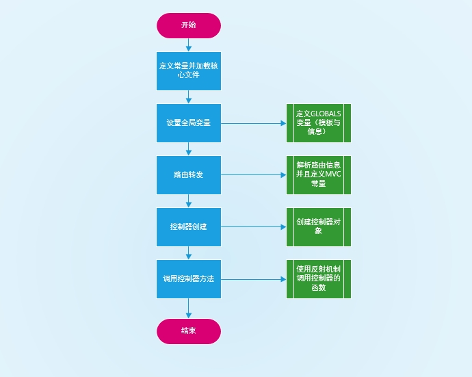
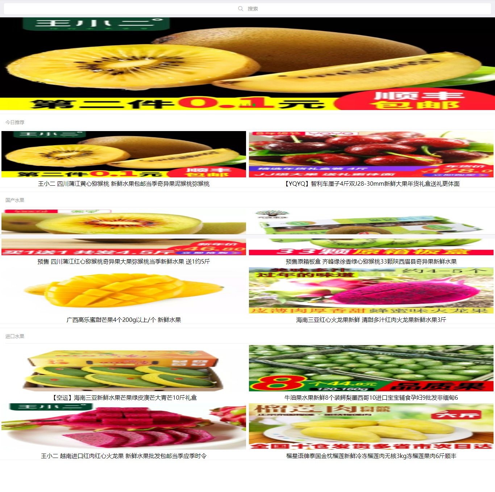
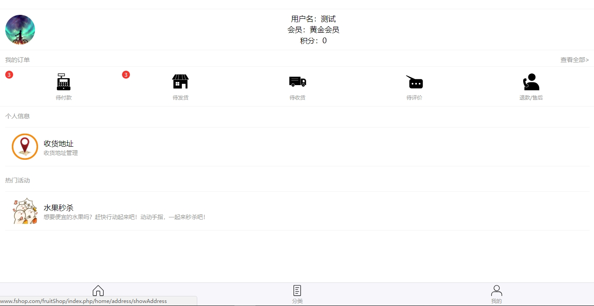
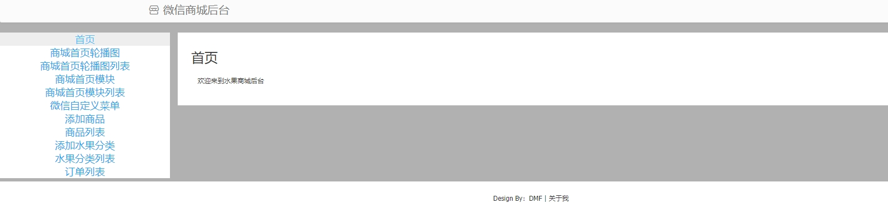
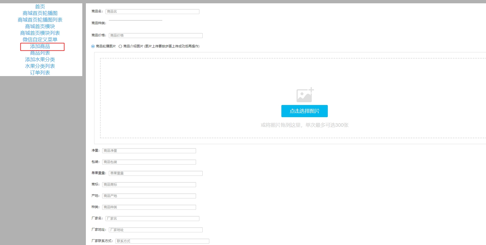

# wechat_fristShop
微信公众号上部署水果商城

##框架流程



##nginx配置

1.隐藏入口文件
```$xslt
location / {
            if (!-e $request_filename) {
	            rewrite ^(.*)$ /index.php/$1 last;
            }
            index  index.html index.htm index.php;
        }
```

2.配置PHP-FPM
```$xslt
location ~ \.php(.*)$ {
    fastcgi_pass   127.0.0.1:9000;
    fastcgi_index  index.php;
    fastcgi_split_path_info  ^((?U).+\.php)(/?.+)$;
    fastcgi_param  SCRIPT_FILENAME  $document_root$fastcgi_script_name;
    fastcgi_param  PATH_INFO  $fastcgi_path_info;
    fastcgi_param  PATH_TRANSLATED  $document_root$fastcgi_path_info;
    include        fastcgi_params;
}
```

##前台功能展示

>首页



>分类


>我的



##后台功能展示

>首页



>商品添加




